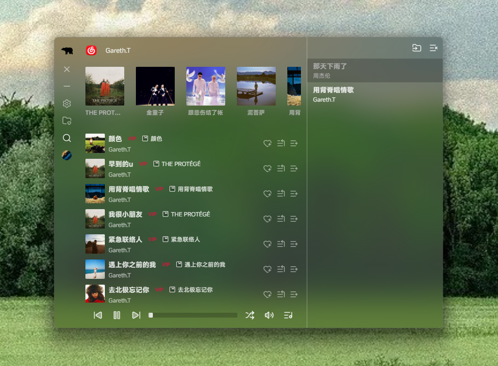
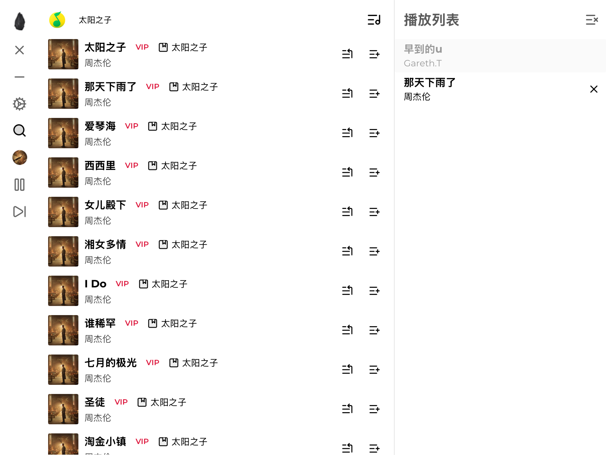
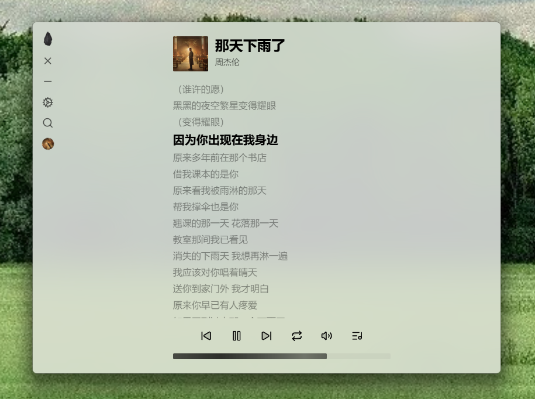

<h1 align="center">NETSIL</h1>

桌面音乐播放平台，聚合 **QQ 音乐** 与 **网易云音乐** 的搜索与播放能力，提供统一的播放队列与播放器体验。

## 截图

  

<h5 align="center">网易云搜索</h5>

  

<h5 align="center">QQ音乐搜索</h5>

  

<h5 align="center">歌曲播放页</h5>

## 下载

- macOS：下载 [netsil-mac.dmg](./release/netsil-mac.dmg?raw=1)（解压后拖到“应用程序”即可）
- Windows：下载 [netsil-win.msi](./release/netsil-win.msi?raw=1)（双击安装即可）

## 安全性

- macOS：苹果菜单 → 系统设置 → 隐私与安全性 → 往下滚到“安全性”区域 → 点“仍要打开 / Open Anyway”
- Windows：双击安装包，点“信任”
